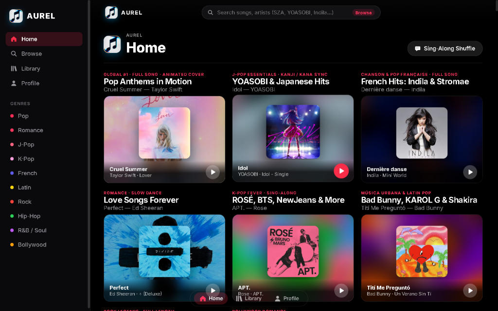
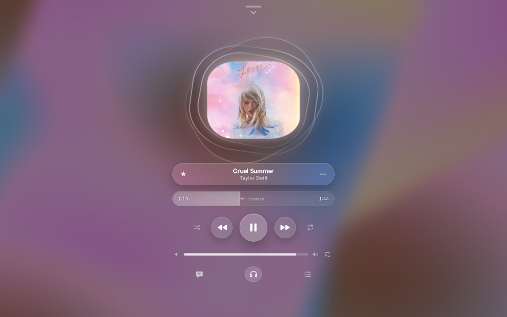
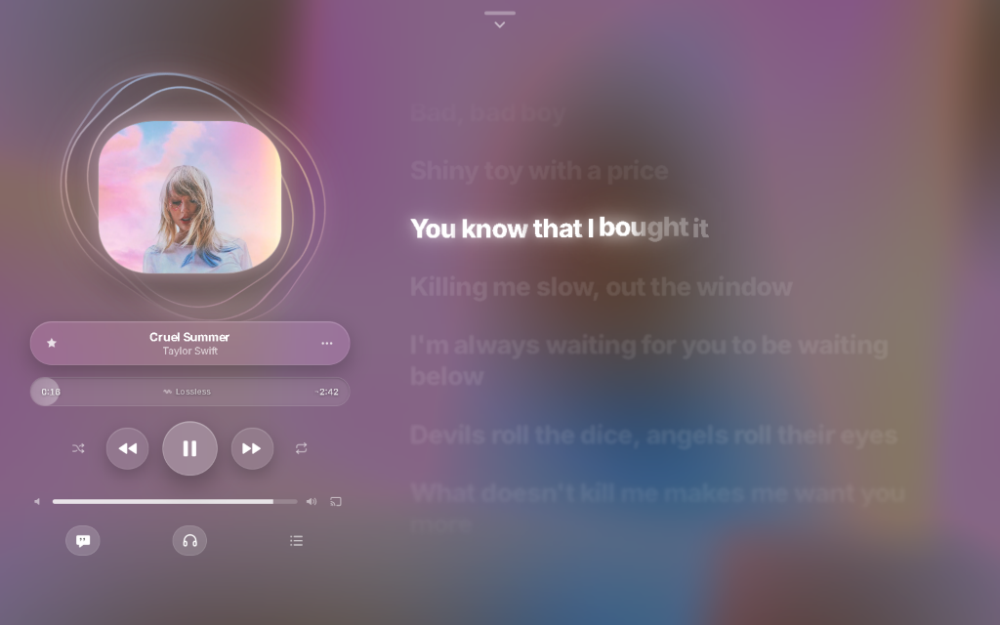
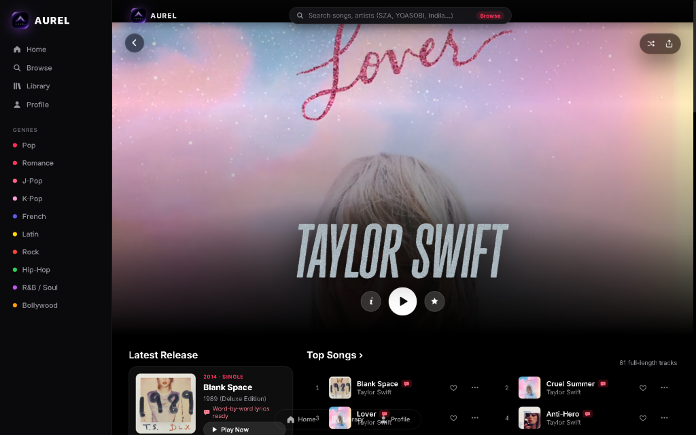

<p align="center">
  
</p>

<h1 align="center">AUREL</h1>

<p align="center">
  Web music player for streaming 337 full-length songs with a frosted Liquid-Aura player UI, word-synchronized lyrics, motion album artwork, and 4K artist profiles.
  <br />
  <a href="https://applemusic.antideploy.app/">Live App</a>
  &nbsp;·&nbsp;
  <a href="https://nikhilmeshram2006.github.io/apple-music-clone-for-me-only/">GitHub Pages Mirror</a>
</p>

---

## Overview

**AUREL** is a personal full-length music streaming web player built with React and Vite, paired with a Python catalog pipeline that resolves 320 kbps AAC streams and bundled local `.m4a` tracks, time-aligned word-by-word lyrics from LRCLIB, looping motion covers, and 4K/2K cinematic artist profiles.

### Features

- **Frosted Liquid-Aura Player UI** — Switchable dual-mode artwork stage (**Liquid Aura rings** ↔ **Rounded Square cover**), frosted glass track info pill, chunky capsule scrubber with inline elapsed/remaining timestamps, and circular frosted glass transport controls.
- **Audio** — **337 full-length tracks** (including 44 bundled local AAC `.m4a` tracks and 320 kbps AAC streams) with MediaSession API support and keyboard shortcuts.
- **Word-Synced Lyrics** — **236 synced-lyric tracks** featuring luminous word-by-word and per-letter fill, syllable weighting across Latin, CJK, Hangul, and Devanagari scripts, and click-to-seek lines.
- **4K Artist Profiles & Visuals** — Canvas fluid mesh backgrounds sampled from cover art, **27 looping motion album covers**, and full-bleed artist profiles across **151 curated artists** (**62** 4K/2K hero motion videos, **149** 4K artist photos, and **61** 2K transparent wordmark logos).
- **Catalog** — **337 pre-indexed tracks** across 10 genres plus live catalog search.
- **Library** — Local persistence for favorites, custom playlists, followed artists, and listening history.
- **Mobile 60fps Performance & PWA** — GPU-composited Liquid-Aura rings (`transform` keyframes), adaptive zero-video mobile hero cards, low-overhead ambient gradients, `content-visibility` shelf virtualization, mobile-optimized word-synced lyrics, installable PWA manifest, and device-adaptive 4K/1080p artist hero playback.

### Catalog Breakdown (`337 Songs` · `151 Artists`)

| Genre | Tracks | Genre | Tracks |
|---|---:|---|---:|
| Romance | 109 | J-Pop | 31 |
| Pop | 42 | K-Pop | 31 |
| Bollywood | 25 | Rock | 23 |
| French | 21 | Latin | 20 |
| Hip-Hop | 19 | R&B / Soul | 16 |

## Screenshots

### Home & Curated Genre Shelves


### Frosted Liquid-Aura Music Player


### Now Playing & Word-Synced Lyrics


### Cinematic 4K Artist Profile


## Development

```bash
npm install
npm run dev
```

To rebuild the catalog and lyrics index:

```bash
pip install requests pycryptodome rapidfuzz pillow
npm run catalog
```

## Production Build

```bash
npm run build
```

Static output is written to `docs/` for deployment.

## License

For personal use.
